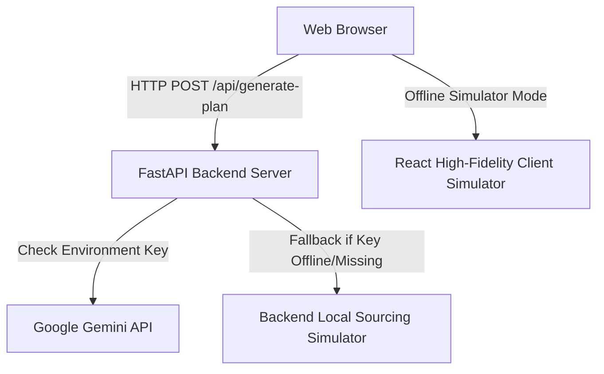

# VeloCook - AI Daily Cooking Planner & Feasibility Engine

Welcome to the official documentation for **VeloCook**, a premium Web Application designed to generate dynamic daily meal plans, grocery checklists, and ingredient substitutions while performing real-time budget feasibility assessments.

The application is optimized for the **Indian culinary landscape**, with specific support for Indian and Maharashtrian cultural cuisines, and handles ultra-low-budget constraints (from ₹10 up to maximum budget) seamlessly.

---

## 📖 Table of Contents
1. [System Architecture](#-system-architecture)
2. [Key Features](#-key-features)
3. [Technology Stack](#-technology-stack)
4. [Installation & Setup](#-installation--setup)
5. [Core Program Logic](#-core-program-logic)
   - [Budget Optimization Model](#budget-optimization-model)
   - [Low-Budget Sourcing Algorithm (₹10 - ₹50)](#low-budget-sourcing-algorithm-10---50)
6. [API Reference](#-api-reference)
7. [UI & UX Highlights](#-ui--ux-highlights)
8. [Vercel Deployment Guide](#-vercel-deployment-guide)

---

## 🏗️ System Architecture

VeloCook follows a decoupled monorepo structure consisting of a **React + Tailwind Frontend** client and a **FastAPI (Python) Backend** service:



The system uses a **Dual-Engine Design**:
1. **Primary AI Engine**: Queries Google Gemini API (`gemini-1.5-flash`) to generate fully bespoke, caloric-coordinated menus matching the user's daily description.
2. **Deterministic Fallback Engine**: If the Gemini API is offline or the environment API key is missing, the backend (and client-side React code) uses a high-fidelity local templates database and a dynamic low-budget solver.

---

## 🌟 Key Features

*   **Premium Startup Portal Loading Screen**: A modern liquid background gradient with a logo zoom scale animation through the letter "o" of "VeloCook".
*   **Indian & Maharashtrian Cuisine Modes**: Options to generate general Indian cuisines (Aloo Paratha, Paneer Bhurji, Dal Tadka) or traditional Maharashtrian cultural dishes (Kanda Poha, Solkadhi, Pithla Bhakri with Thecha, Varan Bhaat).
*   **Dynamic Budget Assessment**: Visual color-coded feasibility badge indicating if calculated daily expenses reside within allocated boundaries.
*   **Ultra-Low-Budget Feasibility (₹10 - ₹50)**: Dynamically scales ingredient portions and maps meal structures to cheap, nutritious local staples, eliminating budget errors.
*   **Interactive Procurement Checklist**: Interactive task checklist with a dynamic percentage completion progress bar to track purchased groceries.
*   **Strategic Ingredient Substitutions**: Advises on swapping high-premium items (e.g. fresh berries, paneer, sirloin steak) for budget alternatives (frozen berries, tofu, chicken thighs).
*   **Accessibility Guide Block**: Embedded hints regarding bulk sourcing, frozen storage benefits, kitchen prep tips, and portion scaling.
*   **PDF Export Module**: High-fidelity `@media print` CSS rules formatting the output report into a beautifully-styled physical print outline.

---

## 💻 Technology Stack

### Frontend
- **Framework**: React.js (Vite compiler)
- **Styling**: Tailwind CSS & Vanilla CSS (Custom light mode with a vibrant golden yellow and emerald green palette)
- **Icons**: Lucide React (using `IndianRupee` for localized pricing context)
- **PDF Export**: Browser-level `window.print()` formatting

### Backend
- **Framework**: FastAPI (Python 3.10+)
- **Validation**: Pydantic v2
- **Server**: Uvicorn ASGI
- **AI Integrations**: Google Gemini REST endpoints via HTTP client requests

---

## 🚀 Installation & Setup

Follow these steps to run VeloCook locally on your workstation.

### Prerequisites
- Node.js (v18+)
- Python (v3.9+)

### 1. Clone the Repository
```bash
git clone https://github.com/LuxShar007/VeloCook.git
cd VeloCook
```

### 2. Backend Setup
1. Navigate into the backend directory:
   ```bash
   cd backend
   ```
2. Create and activate a virtual environment:
   ```bash
   python -m venv venv
   # On Windows:
   .\venv\Scripts\activate
   # On Linux/macOS:
   source venv/bin/activate
   ```
3. Install dependencies:
   ```bash
   pip install -r requirements.txt
   ```
4. Create a `.env` file in the `backend` folder and add your Google Gemini API key:
   ```env
   GEMINI_API_KEY=your_actual_gemini_api_key_here
   ```
5. Launch the FastAPI server:
   ```bash
   python main.py
   ```
   The backend will start running on [http://localhost:8000](http://localhost:8000).

### 3. Frontend Setup
1. Open a new terminal and navigate to the frontend directory:
   ```bash
   cd frontend
   ```
2. Install the required Node packages:
   ```bash
   npm install
   ```
3. Run the Vite development server:
   ```bash
   npm run dev
   ```
   Open your browser to the local address displayed in the terminal (usually [http://localhost:5173](http://localhost:5173)).

---

## ⚙️ Core Program Logic

### Budget Optimization Model
For budgets above **₹50**, the engine utilizes the primary Gemini prompt or standard scaled templates (which cost between ₹145 and ₹305). Expenses are calculated as:

$$\text{Remaining Balance} = \text{Max Budget} - \text{Total Menu Cost}$$

If the remaining balance is negative, the status is marked as **EXCEEDED** (not feasible), prompting the user to either increase their budget or utilize the strategic ingredient substitutions.

### Low-Budget Sourcing Algorithm (₹10 - ₹50)
If the user specifies a budget between ₹10 and ₹50, the template assets are bypassed to prevent failure. A custom solver dynamically divides the budget proportionally and generates meal metrics:

*   **Breakfast Cost**: $30\%$ of total budget (e.g. Cutting Chai & Parle-G)
*   **Lunch Cost**: $35\%$ of total budget (e.g. Pithla & 1 Jowar Bhakri with Thecha)
*   **Dinner Cost**: $35\%$ of total budget (e.g. Varan Bhaat)

The total cost is clamped to the budget exactly, guaranteeing **100% feasibility** while suggesting cheap, high-calorie staples.

---

## 🔌 API Reference

### Plan Generator Endpoint
*   **Route**: `POST /api/generate-plan`
*   **Content-Type**: `application/json`

#### Request Payload Schema
```json
{
  "day_description": "A busy day focusing on high-energy local meals",
  "max_budget": 150.00,
  "cuisine_preference": "maharashtrian"
}
```

#### Response Payload Schema
```json
{
  "is_feasible": true,
  "total_cost": 145.0,
  "remaining_balance": 5.0,
  "meals": {
    "breakfast": {
      "name": "Kanda Poha & Solkadhi",
      "cost": 30.0,
      "description": "Flattened rice cooked with onions, peanuts, curry leaves, and coconut milk kokum drink."
    },
    "lunch": {
      "name": "Pithla Bhakri with Hirvi Mirchi Thecha",
      "cost": 50.0,
      "description": "Gram flour curry served with sorghum flatbread and green chili condiment."
    },
    "dinner": {
      "name": "Varan Bhaat, Batata Bhaji & Sajuk Tup",
      "cost": 65.0,
      "description": "Steamed rice topped with yellow split-pigeon-pea dal and pure ghee."
    }
  },
  "grocery_list": [
    { "id": "mh1", "item": "Poha & Peanuts", "cost": 15.0, "checked": false },
    { "id": "mh2", "item": "Kokum & Coconut milk", "cost": 15.0, "checked": false },
    { "id": "mh3", "item": "Besan & Jowar flour", "cost": 20.0, "checked": false },
    { "id": "mh4", "item": "Green chilies & Garlic", "cost": 10.0, "checked": false },
    { "id": "mh5", "item": "Rice & Toor dal", "cost": 20.0, "checked": false },
    { "id": "mh6", "item": "Potatoes & Onions", "cost": 20.0, "checked": false },
    { "id": "mh7", "item": "Pure Ghee (Sajuk Tup)", "cost": 45.0, "checked": false }
  ],
  "substitutions": [
    { "original": "Kokum", "substitute": "Tamarind paste", "reason": "Saves costs while providing the sour tang." }
  ]
}
```

---

## 🎨 UI & UX Highlights

1.  **Golden Yellow & Emerald Green Palette**: Curated bright CSS tokens mapping state colors (Emerald for success/savings, Amber/Rose for warnings/deficits).
2.  **Glassmorphic Cards**: Sleek panels with subtle shadows (`light-shadow-md`), backdrop filters, and smooth scale transitions (`hover:shadow-emerald-500/15`).
3.  **Responsive Layout**: Full multi-column grid scaling beautifully between dynamic vertical phone stacks and horizontal desktop layouts.

---

## ☁️ Vercel Deployment Guide

Deploying the monorepo on Vercel requires configuring the root-level `vercel.json` file. VeloCook specifies endpoints targeting the sub-directories:

```json
{
  "version": 2,
  "builds": [
    { "src": "backend/main.py", "use": "@vercel/python" },
    { "src": "frontend/package.json", "use": "@vercel/static-build" }
  ],
  "routes": [
    { "src": "/api/(.*)", "dest": "backend/main.py" },
    { "src": "/(.*)", "dest": "frontend/$1" }
  ]
}
```

Simply connect your GitHub repository to Vercel, select the project root, and deploy!
