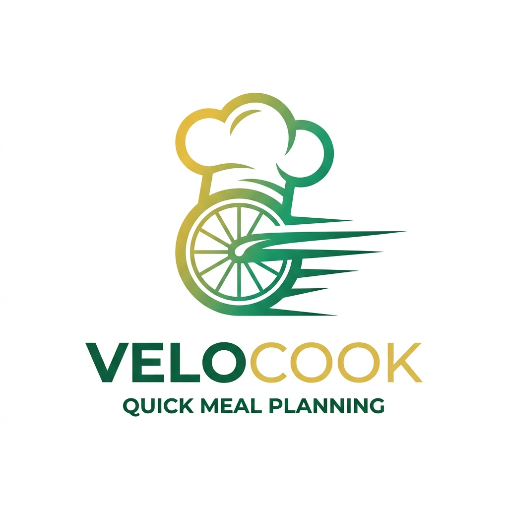
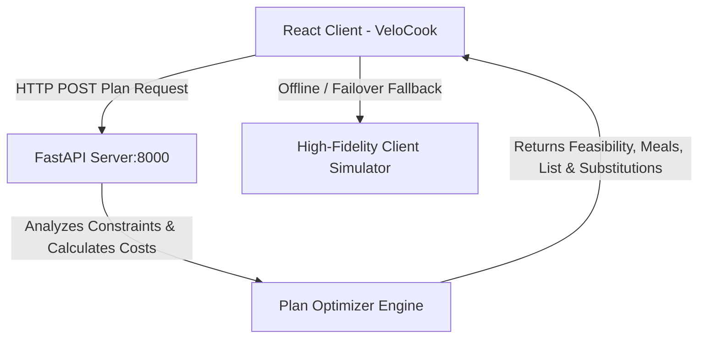

<p align="center">
  
</p>

# VeloCook — AI Cooking To-Do & Budget Feasibility Calculator

VeloCook is a high-fidelity React-based cooking to-do list generator and budget feasibility tool designed with a sophisticated **Management Consulting** theme. It provides an intuitive, centered split-view dashboard to help busy individuals optimize their daily meal architectures and grocery procurement workflows under strict cost boundaries.

---

## 🛠️ Languages & Technologies Used

VeloCook is built using a modern, multi-language web development stack:

*   **JavaScript (ES6+ / JSX)**: Powers the entire interactive React client dashboard, state machines, browser-side simulators, and dynamic checklist rendering.
*   **Python (v3.9+)**: Backend server execution language running FastAPI web frameworks, Pydantic type validators, and the Google Gemini API client queries.
*   **CSS3**: Custom Tailwind CSS styling tokens, custom keyframe loaders, and custom visual responsiveness directives (`@media print` and `@media`).
*   **HTML5**: Semantic web architecture (`<main>`, `<article>`, `<section>`), dark/bright mode canvas setups, and SEO metadata structures.
*   **Markdown**: System blueprint plans, developer walkthroughs, and repository readmes.

---

## 🏛️ System Architecture

The project splits into a responsive, client-side React dashboard and an intelligent, lightweight Python FastAPI server.



### Directory Structure
```text
VeloCook/
├── backend/
│   ├── main.py              # FastAPI server script with CORS & NLP keyword matcher
│   ├── requirements.txt     # Python dependencies (fastapi, uvicorn, pydantic)
│   └── .env                 # Local environment config
│
├── frontend/
│   ├── public/
│   │   └── index.html       # HTML5 entry with Google Fonts & dark theme colors
│   ├── src/
│   │   ├── App.js           # Core UI coordinate, state management & API call
│   │   ├── index.js         # React DOM rendering root
│   │   └── index.css        # Tailwind v4 directives & custom scrollbars
│   ├── package.json         # Node.js project definition
│   └── tailwind.config.js   # Consulting design palette color extensions
│
├── README.md                # Hackathon & execution documentation
└── .gitignore               # Multi-language build-cache and env filters
```

---

## 🎨 Theme & UX Specifications ("Bright Consulting Theme")

VeloCook utilizes a premium bright-mode consulting report aesthetic:
- **Primary Canvas:** Warm Light Gray (`#f8fafc` / `bg-slate-50`) for a clean, professional corporate look.
- **Secondary Cards:** Crisp white cards (`#ffffff`) with subtle light boundaries (`border-slate-200/80`).
- **Typography:** `Inter` (geometric sans-serif readability for data labels) & `Outfit` (clean executive curves for headings).
- **Accent Emerald (`#10b981`):** Applied for success states, ROI indicators, and budget-feasible reports.
- **Accent Golden Yellow (`#f59e0b`):** Bright premium warnings, offline indicators, and micro-branding elements.
- **Interactive Micro-Animations:** Focus-ring highlights on checkboxes, sliding progress tracker bar, and smooth hover elevation cards (`transition-card`).

---

## 🚀 Setup & Execution Guide

### 1. Backend Service Setup (FastAPI)
Navigate to the `backend` folder, set up a Python virtual environment, install requirements, and boot up the server:

```powershell
# Navigate to backend directory
cd backend

# Create virtual environment
python -m venv .venv

# Activate virtual environment
# On Windows PowerShell:
.venv\Scripts\Activate.ps1
# On macOS/Linux:
source .venv/bin/activate

# Install dependencies
pip install -r requirements.txt

# Start local server (Runs on port 8000)
python main.py
```

### 2. Frontend Application Setup (React / Vite)
Open a separate terminal window, navigate to the `frontend` folder, install packages, and boot up the hot-reload developer server:

```powershell
# Navigate to frontend directory
cd frontend

# Install packages
npm install

# Start developer server (Runs on http://localhost:5173 by default)
npm run dev
```

---

## 🛡️ Senior UX Failover Mechanics (Offline Demo Mode)

To guarantee an outstanding evaluation experience even if the Python API backend is offline:
- **Heartbeat Verification:** On page load, VeloCook queries the API server. An status indicator badge in the header shows whether the client is connected to the live API or using local simulations.
- **Auto-Failover:** If a user submits a prompt while the server is offline, the React app automatically falls back to the local NLP-based Simulator, displays a warning banner, and computes the budget feasibility and balance sheet client-side.
- **Quick-Fill Templates:** Preset buttons allow clicking to pre-load specific day descriptions (Keto, Vegan, Busy Workday) and budgets to test feasibility logic instantly.

---

## ♿ Accessibility (A11y) & Semantic Code Quality

- **Semantic HTML Markup:** Avoids generic div soup. Wraps the main layout inside `<main>`, inputs inside `<section aria-labelledby="inputs-heading">`, and output elements in `<section aria-labelledby="results-heading">` using proper headings structure.
- **Polite Announcements:** The results panel is designated with `aria-live="polite"` so screen readers speak updates when meal plans regenerate.
- **Accessible Inputs:** Every input element has an associated descriptive `<label>` pointing directly to the input via matching `id` and `htmlFor` configurations.
- **Keyboard Usability:** Custom styles ensure that checkbox lists are fully traversable and exhibit high-visibility focus borders (`focus-ring`) when navigated via tab keys.
